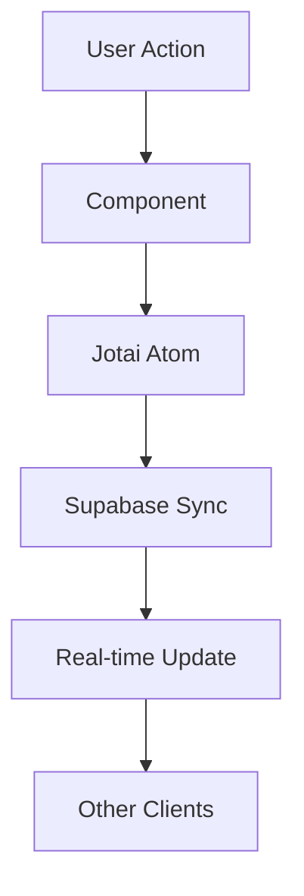

# Thirty Challenge - Real-time Football Quiz Web App

[](https://app.netlify.com/projects/thirtychallenge/deploys)
[](https://github.com/ellerbrock/typescript-badges/)
[](https://reactjs.org/)
[](https://vitejs.dev/)
[](https://tailwindcss.com/)
[](https://supabase.com/)
[](https://daily.co/)
[](https://quiz.tyshub.xyz)
[](https://thirtyquiz.tyshub.xyz)

> **Real-time, club-themed football quiz web app** with video conferencing, Arabic language support, and sequential quiz segments.

## 🚀 Live Demo

Visit **[thirtyquiz.tyshub.xyz](https://thirtyquiz.tyshub.xyz/)** to experience the app in action!

## 📋 Table of Contents

- [Overview](#overview)
- [Features](#features)
- [Tech Stack](#tech-stack)
- [Quick Start](#-quick-start)
- [Development](#development)
- [Architecture](#architecture)
- [Quiz Segments](#quiz-segments)
- [Deployment](#deployment)
- [Contributing](#contributing)
- [Project Structure](#project-structure)

## 🎯 Overview

Thirty Challenge is a modern, real-time football quiz application designed for club-themed competitions. Built with React 19 and featuring seamless video integration via Daily.co, it supports Arabic language and provides an engaging quiz experience with multiple interactive segments.

### Key Highlights

- **Real-time Multiplayer**: Host + 2 players with live video conferencing
- **Arabic Language Support**: Fully localized interface and content
- **Sequential Quiz Segments**: BELL, SING, REMO, WSHA, AUCT segments
- **Modern Stack**: React 19, Vite 7, TypeScript, Tailwind CSS
- **Performance Optimized**: <200kB bundle size requirement
- **Production Ready**: Deployed on Netlify with CI/CD

## ✨ Features

### 🎮 Game Features

- **Multi-user Lobby**: Create and join game sessions
- **Video Conferencing**: Integrated Daily.co video rooms
- **Real-time Sync**: Supabase-powered live game state
- **Dynamic Scoring**: Points tracking and winner determination
- **Segment Controls**: Host-controlled quiz progression

### 🌐 Technical Features

- **Responsive Design**: Mobile-first Tailwind CSS
- **Type Safety**: Full TypeScript coverage
- **State Management**: Jotai atoms for efficient state
- **Animation**: Framer Motion for smooth transitions
- **Testing**: Vitest/Jest test suite
- **Bundle Analysis**: Size monitoring and optimization

### 🌍 Internationalization

- **Arabic Language**: RTL support and localized content
- **English Fallback**: Dual language toggle
- **Cultural Adaptation**: Club-themed quiz content

## 🛠 Tech Stack

| Category       | Technology    | Version | Purpose                  |
| -------------- | ------------- | ------- | ------------------------ |
| **Frontend**   | React         | 19      | UI Framework             |
| **Build Tool** | Vite          | 7       | Development & Build      |
| **Styling**    | Tailwind CSS  | 3.4     | Utility-first CSS        |
| **Language**   | TypeScript    | 5.8.3   | Type Safety              |
| **State**      | Jotai         | 2.12.5  | Atomic State Management  |
| **Animation**  | Framer Motion | 12      | Motion & Transitions     |
| **Backend**    | Supabase      | 2.52.1  | Database & Realtime      |
| **Video**      | Daily.co      | 0.81.0  | Video Conferencing       |
| **Testing**    | Vitest/Jest   | 29.7.0  | Unit & Integration Tests |
| **Deployment** | Netlify       | -       | Static Site Hosting      |

## 🚀 Quick Start

### Prerequisites

- **Node.js** 18+
- **pnpm** 10+ (recommended)
- **Supabase** account (for backend)
- **Daily.co** account (for video)

### Installation

```bash
# Clone the repository
git clone https://github.com/AmberMaze/thirty-challenge-code.git
cd thirty-challenge-code

# Install dependencies
pnpm install

# Copy environment variables
cp .env.example .env
# Edit .env with your Supabase and Daily.co credentials

# Start development server
pnpm dev

# Open browser to http://localhost:5173
```

### Environment Setup

Create a `.env` file with the following variables:

```env
# Daily.co Configuration
DAILY_API_KEY=your_daily_api_key
VITE_DAILY_DOMAIN=your_daily_domain

# Supabase Configuration
VITE_SUPABASE_URL=your_supabase_url
VITE_SUPABASE_ANON_KEY=your_supabase_anon_key
SUPABASE_SERVICE_ROLE_KEY=your_service_role_key

# Development
NETLIFY_DEV=true
```

## 🔧 Development

### Available Scripts

```bash
# Development
pnpm dev              # Start development server
pnpm dev:netlify      # Start with Netlify functions

# Building
pnpm build            # Production build
pnpm preview          # Preview production build

# Quality Assurance
pnpm test             # Run tests
pnpm lint             # ESLint checking
pnpm format           # Prettier formatting
pnpm tsc --noEmit     # TypeScript checking

# Analysis
pnpm dep:graph        # Generate dependency graph
pnpm flow:update      # Update flowchart documentation
pnpm analyze          # Bundle size analysis
```

### Development Workflow

1. **Code Quality**: ESLint + Prettier + TypeScript
2. **Testing**: Vitest for unit/integration tests
3. **Bundle Monitoring**: <200kB JS bundle enforced
4. **Dependency Tracking**: Madge for circular dependency detection

## 🏗 Architecture

### State Management

- **Jotai Atoms**: Small, focused state pieces in `src/state/`
- **Game Context**: Centralized game state management
- **Real-time Sync**: Supabase channels for live updates

### Component Structure

```
src/
├── components/     # Reusable UI components
├── pages/         # Route-level components
├── segments/      # Quiz segment logic
├── hooks/         # Custom React hooks
├── lib/           # Utilities and configurations
├── state/         # Jotai atoms and state
└── types/         # TypeScript definitions
```

### Data Flow



## 🎯 Quiz Segments

| Segment  | Description       | Points | Duration |
| -------- | ----------------- | ------ | -------- |
| **WSHA** | Team Recognition  | 4      | Variable |
| **BELL** | Quick Answer Bell | 10     | Timed    |
| **SING** | Audio/Music Round | 10     | Timed    |
| **REMO** | Penalty Kicks     | 4      | Variable |
| **AUCT** | Auction Bidding   | 4      | Variable |

Each segment has custom logic in `src/segments/` with specialized hooks and components.

## 🚀 Deployment

### Netlify Deployment

The app is automatically deployed to Netlify on every push to `main`:

1. **Build Command**: `pnpm build`
2. **Publish Directory**: `dist`
3. **Environment Variables**: Set in Netlify dashboard
4. **Functions**: Serverless functions in `netlify/functions/`

### Manual Deployment

```bash
# Build for production
pnpm build

# Preview locally
pnpm preview

# Deploy to Netlify (requires CLI)
netlify deploy --prod
```

## 🤝 Contributing

### Pull Request Checklist

- [ ] Code compiles (`pnpm tsc --noEmit`)
- [ ] ESLint passes (`pnpm lint`)
- [ ] Tests pass (`pnpm test`)
- [ ] Bundle size <200kB
- [ ] Dependency map updated if needed
- [ ] Documentation updated

### Development Guidelines

- **Components**: Function components with hooks only
- **Styling**: Tailwind utility classes only
- **State**: Jotai atoms for state management
- **Bundle**: Monitor size with each import
- **Types**: Full TypeScript coverage

## 📁 Project Structure

```
thirty-challenge-code/
├── src/
│   ├── components/         # Reusable UI components
│   ├── pages/             # Route components
│   ├── segments/          # Quiz segment logic
│   ├── hooks/             # Custom React hooks
│   ├── lib/               # Utilities & config
│   ├── state/             # Jotai atoms
│   └── types/             # TypeScript definitions
├── netlify/
│   └── functions/         # Serverless functions
├── docs/                  # Documentation
├── public/                # Static assets
└── scripts/               # Build & utility scripts
```

## 📚 Documentation

- [Project Overview](docs/PROJECT_OVERVIEW.md) - Comprehensive project details
- [Agent Guidelines](docs/AGENTS.md) - AI development guidelines
- [Quiz Structure](docs/QUIZ_STRUCTURE.md) - Game flow and segments
- [Daily.co Integration](docs/DAILY_CO_INTEGRATION.md) - Video setup
- [Workflows](docs/WORKFLOWS.md) - Development processes

## 📄 License

This project is proprietary. All rights reserved.

## 🙏 Acknowledgments

- **React Team** for React 19
- **Vite Team** for blazing fast builds
- **Supabase** for backend-as-a-service
- **Daily.co** for video infrastructure
- **Tailwind CSS** for utility-first styling

---

**Built with ❤️ for the football community**

For questions or support, please refer to the documentation in the `docs/` directory.
